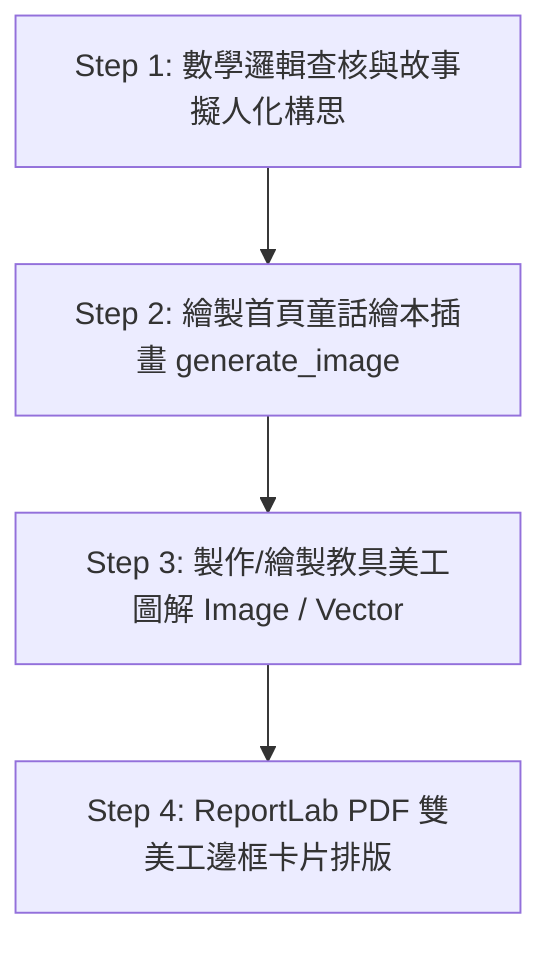

# 🎨 兒童數學美工繪本與教案插畫設計 SOP (Skill Guide)

本 Skill 記錄為小學低年級及幼稚園大班數學教案進行 **「童話繪本首頁視覺」** 與 **「教具實作美工圖解」** 的完整製作標準流程 (SOP)。日後如有類似美工設計或教案視覺升級需求，可直接參考並重複使用本 SOP。

---

## 🎯 視覺 Tone and Manner 規範

| 元素類別 | 設計規範 (Tone & Manner) | 關鍵 Prompt 詞彙 / 視覺風格 |
|---|---|---|
| **課程首頁視覺** | 迪士尼/皮克斯 (Pixar 3D) 溫馨粉彩童話繪本風、擬人化/布偶化可愛小動物角色、充滿奇幻故事感 | `3D Pixar style storybook picture illustration`, `anthropomorphic cute character`, `vibrant pastel colors`, `cheerful Disney lighting` |
| **教具實作圖解** | 清晰高彩度向量/圖解卡片風、結構明確、包含算式提示框、箭頭指引與符號對應 | `clean educational vector graphic diagram`, `kid math workbook style`, `labeled equation overlay`, `high contrast card container` |
| **配色系統 (Palette)** | 主色：珊瑚粉 `#FF6B6B`、薄荷綠 `#4ECDC4` 輔助色：溫暖太陽黃 `#FFE66D`、質感炭灰字 `#2D3436` 卡片底色：淡奶油黃 `#FFFDE7`、淡清爽綠 `#E8F8F5` | 避免使用刺眼純原色，採用低飽和高彩度的溫和兒童色彩。 |

---

## 📋 4 步驟美工教案製作 SOP

### Step 1: 數學邏輯查核與故事擬人化構思
1. **確定年齡層**：區分幼稚園大班 (5-6歲) 或小學低年級 (6-8歲)，調整數學目標。
2. **擬人化角色登場**：將抽象數學概念包裝為童話情境：
   - 10 的分解與合成 ➔ 小兔班班與小熊小寶的積木派對 (Snap It!)
   - 數線位移 ➔ 袋鼠媽媽與小袋鼠的彩虹數線 (Number Line Jumpers)
   - 幾何拼貼 ➔ 小松鼠藝術家的幾何蝴蝶 (Pattern Blocks)

### Step 2: 繪製首頁童話繪本插畫 (`generate_image`)
使用 `generate_image` 工具生成吸引好奇心的首頁 3D 插畫：
- **Prompt 模板**：
  > `Charming 3D Pixar style storybook picture illustration for kids: [擬人化角色與情境描述], vibrant cartoon style, highly engaging and magical for children math lesson`

### Step 3: 製作教具美工圖解 (`generate_image` 或 PIL/ReportLab Vector)
呈現實體教具操作（如：卡扣積木、十格陣、天平、骰子）：
- **Prompt 模板 (AI 生成)**：
  > `Clean educational vector graphic diagram for children math workbook: [教具與算式圖解描述], labeled with equation [算式], clear child-friendly layout`
- **備用/補充機制 (PIL / ReportLab Vector)**：
  當遇到 API 限額或需要精準幾何線條時，採用 PIL / ReportLab Drawing 繪製同調性的向量圖解框。

### Step 4: 雙美工邊框與 PDF 繪本排版 (`ReportLab`)
1. **標題橫幅 (Header Banner)**：全寬粉色/綠色圓角矩形標題列。
2. **課程首頁美工 (Landing Cover Art)**：置頂放放大繪本插圖 (寬 380px)。
3. **童話故事卡 (Story Card)**：淡黃底色 `#FFFDE7` + 太陽黃邊框 `#FFE66D`。
4. **教具圖解卡 (Tool Card)**：薄荷綠底色 `#E8F8F5` + 綠色邊框 `#4ECDC4` + 圖解插圖。
5. **查核標籤 (Verification Badge)**：灰色精緻目標與邏輯標籤。

---

## 🛠️ 自動化腳本模板參考

於專案目錄下已建立以下自動化腳本與產出備份：
- **圖片生成腳本**：`generated_art/`
- **PDF 彙整腳本**：`Elementary_Math_Curriculum_Pixar_Storybook_Master.pdf`
- **Master 資料檔**：`units_curriculum_master.json`
